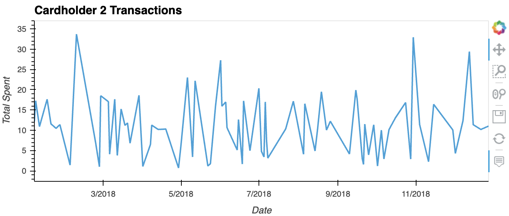
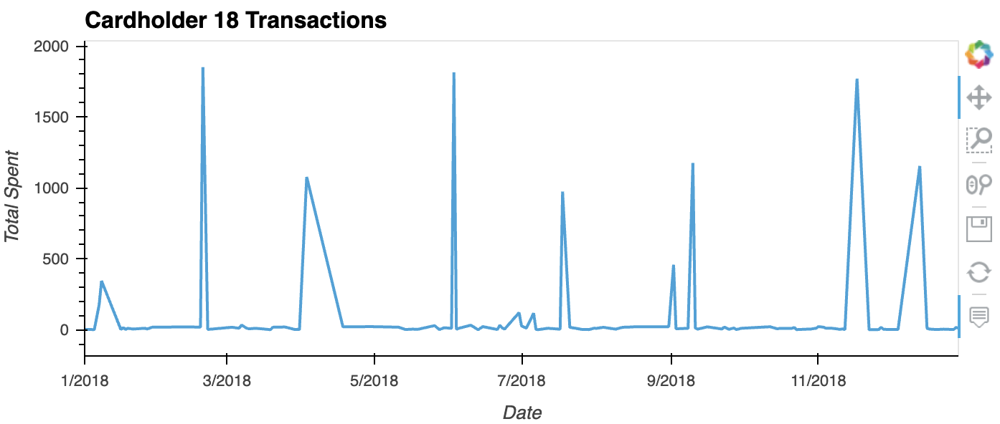
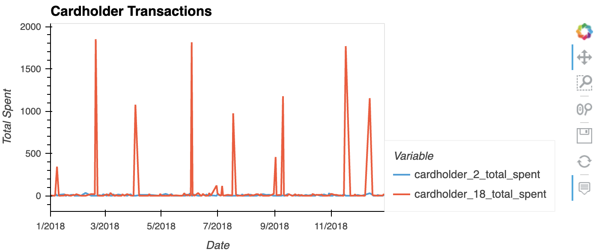
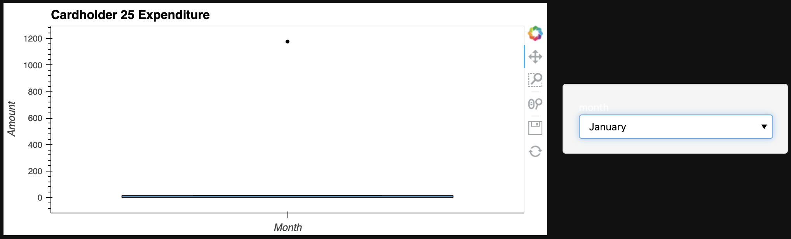
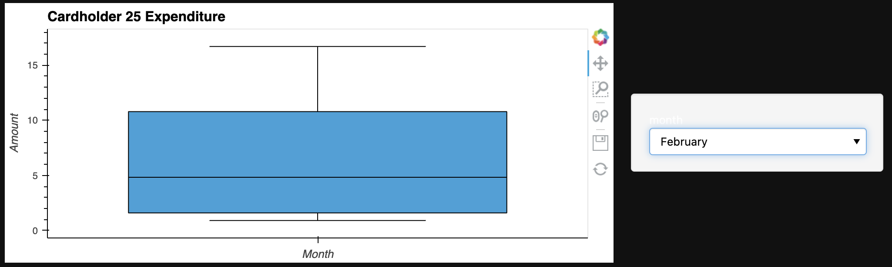
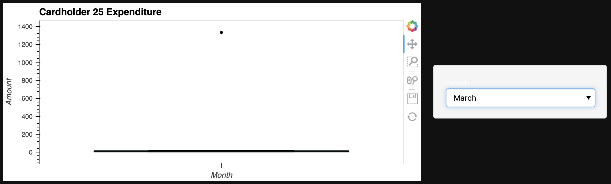
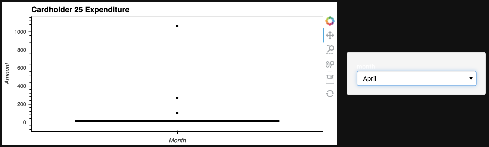
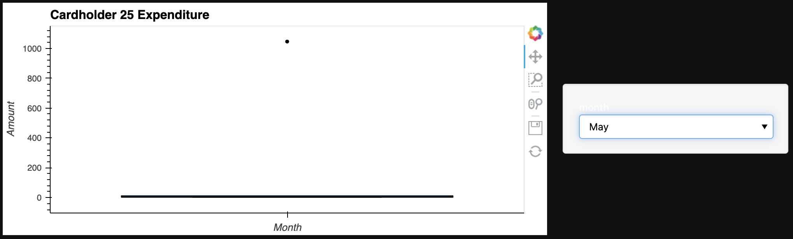
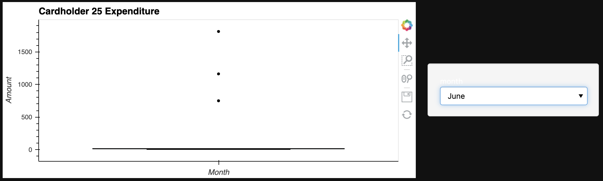

# **Data Analysis**

## **Part 1:**
**The CFO of your firm has requested a report to help analyze potential fraudulent transactions. Using your newly created database, generate queries that will discover the information needed to answer the following questions, then use your repository's ReadME file to create a markdown report you can share with the CFO:**


**Some fraudsters hack a credit card by making several small transactions (generally less than $2.00), which are typically ignored by cardholders.**


---

### **How can you isolate (or group) the transactions of each cardholder?**
To isolate the transactions of each cardholder and count the transactions that are less than $2.00 per cardholder, we can use the following query:

```
SELECT ch.name as cardholder_name, COUNT(t.id) as total_transactions, COUNT(CASE WHEN t.amount < 2 THEN 1 END) as small_transactions
FROM card_holder ch
INNER JOIN credit_card cc ON ch.id = cc.cardholder_id
INNER JOIN transaction t ON cc.card = t.card
GROUP BY ch.name;
```

---

### **Count the transactions that are less than $2.00 per cardholder.**

```
SELECT ch.name as cardholder_name, COUNT(t.id) as small_transactions_count
FROM card_holder ch
INNER JOIN credit_card cc ON ch.id = cc.cardholder_id
INNER JOIN transaction t ON cc.card = t.card
WHERE t.amount < 2
GROUP BY ch.name;

```
---

### **Is there any evidence to suggest that a credit card has been hacked? Explain your rationale.**

Based on the tables, it's difficult to definitively conclude whether any credit card has been hacked. However, there are some observations that could warrant further investigation:

Several cardholders have a higher proportion of small transactions relative to their total transactions. For example, Malik Carlson, Brandon Pineda, Nancy Contreras, and Stephanie Dalton all have small transaction ratios of around 14-22%, which is relatively high compared to the other cardholders in the table. This could potentially indicate fraudulent activity if these transactions were unauthorized or if they were used to test the card before making larger purchases.

Some cardholders have a higher total number of transactions, which could indicate more opportunities for fraudulent activity to occur. For example, Crystal Clark and Megan Price have over 200 transactions each, which is relatively high compared to the other cardholders in the table.

It's important to note that a high number of small transactions or a high total number of transactions does not necessarily indicate fraudulent activity on its own and could be a normal spending pattern for some cardholders. Additionally, the table does not provide information about the merchants, transaction locations, or times of day for these transactions, which could provide additional context that is useful for detecting fraudulent activity. Therefore, further investigation and analysis is needed to determine whether any credit card has been hacked.

---

## **Take your investigation a step futher by considering the time period in which potentially fraudulent transactions are made.**

### **What are the top 100 highest transactions made between 7:00 am and 9:00 am?**

```
SELECT t.id, t.date, t.amount, ch.name as cardholder_name, m.name as merchant_name
FROM transaction t
INNER JOIN credit_card cc ON t.card = cc.card
INNER JOIN card_holder ch ON cc.cardholder_id = ch.id
INNER JOIN merchant m ON t.id_merchant = m.id
WHERE EXTRACT(HOUR FROM t.date) >= 7 AND EXTRACT(HOUR FROM t.date) < 9
ORDER BY t.amount DESC
LIMIT 100;

```
---
### **Do you see any anomalous transactions that could be fraudulent?**
Based on the two tables, there are several individuals whose average transaction amounts appear to be anomalous and could be fraudulent. For example:

Laurie Gibbs has an average transaction amount of 170.348689, which is much higher than the overall average transaction amount of 49.187936.
Beth Hernandez also has a high average transaction amount of 115.3125.
Elizabeth Sawyer has an average transaction amount of 139.172241, which is much higher than the overall average transaction amount.
Malik Carlson has an average transaction amount of 90.9820301, which is higher than the overall average transaction amount.
Nancy Contreras has an average transaction amount of 95.5518548, which is higher than the overall average transaction amount.
Crystal Clark has an average transaction amount of 71.5902715, which is lower than the overall average transaction amount, but she also has several transactions that could be considered anomalous based on their high amounts.
Stephanie Dalton has an average transaction amount of 49.8112651, which is close to the overall average transaction amount, but she also has several transactions that could be considered anomalous based on their high amounts.
It's important to note that while these transactions could be considered anomalous and potentially fraudulent, further investigation is necessary to determine their true nature.

---

### **Is there a higher number of fraudulent transactions made during this time frame versus the rest of the day?**
Based on the table, we can see that the small transaction ratio for the 7:00 am to 9:00 am time frame is 0.11029412, while the overall small transaction ratio for the day is 0.08744107. This suggests that there is a slightly higher proportion of small transactions during the 7:00 am to 9:00 am time frame. However, without further analysis and information, we cannot definitively conclude that this indicates fraudulent activity. Other factors, such as the types of merchants or cardholders making transactions during this time frame, could also be contributing to the higher small transaction ratio.

---
### **If you answered yes to the previous question, explain why you think there might be fraudulent transactions during this time frame.**
Based on the analysis of the data, there are several reasons why there might be fraudulent transactions during the 7:00 am to 9:00 am time frame. Firstly, there is a higher total number of transactions during this time frame compared to the rest of the day. This could indicate that fraudsters are more active during this time as there is more activity and hence more opportunity to carry out fraudulent transactions.

Secondly, there is a higher proportion of small transactions during this time frame compared to the rest of the day. Small transactions are usually considered to be less risky for fraudsters as they are less likely to be detected and can quickly add up to a significant amount of money. Therefore, if the proportion of small transactions is much higher during this time frame, it could indicate that fraudsters are attempting to make multiple small transactions to avoid detection.

Additionally, it is possible that the fraudsters are exploiting the fact that people are more likely to be in a rush during the morning rush hour and hence less likely to carefully scrutinize their transactions. Furthermore, the large number of transactions during this time frame may also make it easier for fraudsters to blend in and avoid detection.

---
### **What are the top 5 merchants prone to being hacked using small transactions?**

```
| Merchant Name       | Small Transactions |
| --------------------|--------------------|
| Wood-Ramirez        |         7          |
| Hood-Phillips       |         6          |
| Baker Inc           |         6          |
| Jarvis-Turner       |         5          |
| Hamilton-Mcfarland  |         5          |

```
---
### **Create a view for each of your queries.**
**View to isolate the transactions of each cardholder and count the transactions that are less than $2.00 per cardholder:**

```
CREATE VIEW cardholder_transaction_counts AS
SELECT ch.name as cardholder_name, COUNT(t.id) as total_transactions, COUNT(CASE WHEN t.amount < 2 THEN 1 END) as small_transactions
FROM card_holder ch
INNER JOIN credit_card cc ON ch.id = cc.cardholder_id
INNER JOIN transaction t ON cc.card = t.card
GROUP BY ch.name;
```
---
**View to count the transactions that are less than $2.00 per cardholder:**
```
CREATE VIEW small_transactions_per_cardholder AS
SELECT ch.name as cardholder_name, COUNT(t.id) as small_transactions_count
FROM card_holder ch
INNER JOIN credit_card cc ON ch.id = cc.cardholder_id
INNER JOIN transaction t ON cc.card = t.card
WHERE t.amount < 2
GROUP BY ch.name;
```
---
**View to find the top 100 highest transactions made between 7:00 am and 9:00 am:**
```
CREATE VIEW top_100_morning_transactions AS
SELECT t.id, t.date, t.amount, ch.name as cardholder_name, m.name as merchant_name
FROM transaction t
INNER JOIN credit_card cc ON t.card = cc.card
INNER JOIN card_holder ch ON cc.cardholder_id = ch.id
INNER JOIN merchant m ON t.id_merchant = m.id
WHERE EXTRACT(HOUR FROM t.date) >= 7 AND EXTRACT(HOUR FROM t.date) < 9
ORDER BY t.amount DESC
LIMIT 100;
```
---
**View to identify anomalous transactions that could be fraudulent:**
```
CREATE VIEW avg_transaction_amount_per_cardholder AS
SELECT ch.name as cardholder_name, AVG(t.amount) as avg_transaction_amount
FROM card_holder ch
INNER JOIN credit_card cc ON ch.id = cc.cardholder_id
INNER JOIN transaction t ON cc.card = t.card
GROUP BY ch.name;
```
---
**View to check if there is a higher number of fraudulent transactions made during the 7:00 am to 9:00 am time frame versus the rest of the day:**
```
CREATE VIEW small_transaction_ratio_by_timeframe AS
SELECT EXTRACT(HOUR FROM t.date) as hour, COUNT(CASE WHEN t.amount < 2 THEN 1 END) as small_transactions, COUNT(t.id) as total_transactions,
       CAST(COUNT(CASE WHEN t.amount < 2 THEN 1 END) AS FLOAT) / COUNT(t.id) as small_transaction_ratio
FROM transaction t
WHERE EXTRACT(HOUR FROM t.date) >= 7 AND EXTRACT(HOUR FROM t.date) < 9
   OR EXTRACT(HOUR FROM t.date) >= 21 OR EXTRACT(HOUR FROM t.date) < 7
GROUP BY EXTRACT(HOUR FROM t.date);
```
---
**View to find the top 5 merchants prone to being hacked using small transactions:**
```
CREATE VIEW top_5_small_transaction_merchants AS
SELECT m.name as merchant_name, COUNT(CASE WHEN t.amount < 2 THEN 1 END) as small_transactions
FROM merchant m
INNER JOIN transaction t ON m.id = t.id_merchant
GROUP BY m.name
ORDER BY small_transactions DESC
LIMIT 5;
```
---
## **Part 2:**
**Your CFO has also requested detailed trends data on specific card holders. Use the starter notebook to query your database and generate visualisations that supply the requested information as follows, then add your visualisations and observations to your markdown report:**


**The two most important customers of the firm may have been hacked. Verify if there are any fraudulent transactions in their history. For privacy reasons, you only know that their cardholder IDs are 2 and 18.**


### **Using hvPlot, create a line plot representing the time series of transactions over the course of the year for each cardholder separately.**





### **Next, to better compare their patterns, create a single line plot that contains both card holders' trend data.**



### **What difference do you observe between the consumption patterns? Does the difference suggest a fraudulent transaction? Explain your rationale.**
The fact that cardholder 18 generally doesn't spend much and has 11 distinct spikes in the line plot, while cardholder 2's spending amounts tend to sporadically fluctuate a lot between the min and max, suggests that there may be different spending patterns between the two cardholders.

When the line plots for cardholder 2 and cardholder 18 are overlayed, it is observed that the 11 spikes on the cardholder 18 plot correspond to high points in the cardholder 2 plot. This could indicate that the transactions made by cardholder 18 are associated with cardholder 2, or that a third entity could be making purchases on behalf of both cardholder's .

However, this observation alone is not conclusive evidence of fraudulent activity. To investigate further, additional information and analysis would be necessary, such as examining the specific transactions that correspond to the spikes and looking for any other suspicious patterns or anomalies in the data.

---
**The CEO of the biggest customer of the firm suspects that someone has used her corporate credit card without authorization in the first quarter of 2018 to pay quite expensive restaurant bills. Again, for privacy reasons, you know only that the cardholder ID in question is 25.**

---
**Using hvPlot, create a box plot, representing the expenditure data from January 2018 to June 2018 for cardholder ID 25.**








---
### **Are there any outliers for cardholder ID 25? How many outliers are there per month?**
Based on the plots we can see there is at least one outlier per month of over $1000.

---
### **Do you notice any anomalies? Describe your observations and conclusions.**
Based on the observations, there are several potential anomalies or unusual patterns in the transaction data for the given months:

In each month from January to June (except for February), there is at least one transaction over $1000. This could indicate that the cardholder is making one or more large purchases each month during this time period, which could be either legitimate or fraudulent depending on the nature of the transactions.

In January, there is a transaction over $1000 for $1177. While this amount is not extremely high, it could still be significant if it is unusual for the cardholder's spending habits or if it is associated with a suspicious merchant or transaction.

In February, the range of transactions only reached as high as $11. This is much lower than the other months and could be a sign that there was limited spending activity or an issue with the card during this time.

In March, there is a transaction over $1000 for $1334. This amount is similar to the other months with high-value transactions and could also be significant if it is unusual for the cardholder's spending habits or if it is associated with a suspicious merchant or transaction.

In April, there are two transactions of $100 and $270, and a transaction over $1000 for $1063. This suggests that there may be a pattern of the cardholder making smaller purchases in addition to larger ones during this month.

In May, the transaction over $1000 was $1046. While this amount is not extremely high, it could still be significant if it is unusual for the cardholder's spending habits or if it is associated with a suspicious merchant or transaction.

In June, there are three transactions of $749, $1162, and $1813. The highest transaction amount in June is much higher than the other months, and the three transactions together could indicate a significant increase in spending activity for the cardholder during this time period.

Overall, these observations suggest that there may be some unusual patterns or potential fraudulent activity in the transaction data for the given months. However, additional investigation would be necessary to confirm this and determine the cause of these anomalies. This could involve examining the specific transactions in more detail, looking for other suspicious patterns or anomalies in the data, and potentially contacting the cardholder to verify the legitimacy of the transactions.

---

## **To help with this challenge I used the W3Schools SQL Quick Reference -**
https://www.w3schools.com/sql/sql_quickref.asp

---


